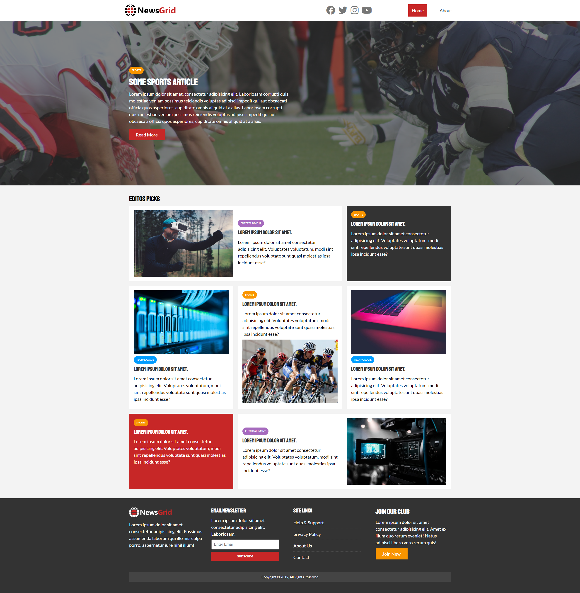

this project has been made while taking the course of Modern HTML & CSS From The Beginning from Brad Traversy 👉 https://www.udemy.com/course/modern-html-css-from-the-beginning/

# News Website

News Website

## Features

- Modern layout with custom colors/styles/backgrounds
- Responsive design
- Sticky navbar
- Form & input styles
- Contact page

## Usage

This website is built with [css, html ] [Font Awesome](https://fontawesome.com/) for icons.

# THX;
